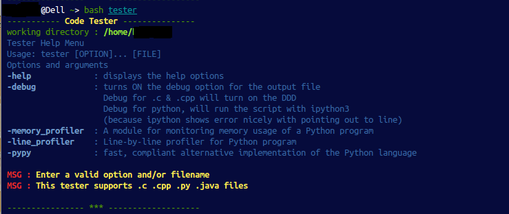

code-tester
===========

the Ultimate Programming Tester

This is a shell script. This script support .c , .cpp , .py , .java files

## Screenshot

## Prerequisites 
  
 * gcc         — GNU project C and C++ compiler.
 * g++]         — GNU project C and C++ compiler.
 * python3         — an interpreted, interactive, object-oriented programming language.
 * ipython3 — Tools for Interactive Computing in Python.
 * pypy     — fast, compliant alternative implementation of the Python language.
 * memory_profiler        — A module for monitoring memory usage of a python program.
 * line_profiler         — Line-by-line profiler.
 * DDD         — The Data Display Debugger
 * java compiler — Java development environment (install OpenJDK)

## Installing
